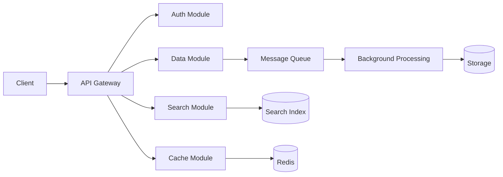

# Modules & Components

> ⚠️ **Warning:** This file was generated by AI and has not been reviewed yet.

This document provides detailed information about ExplorerIO's modular architecture and the key components that make up the system.

## Core Modules

### Authentication Module

**Purpose**: Handles user authentication, authorization, and session management.

**Components**:
- User Management Service
- JWT Token Service
- Role-Based Access Control (RBAC)
- Password Security Manager

**Key Features**:
- Multi-factor authentication support
- Social login integration (Google, GitHub, etc.)
- Session timeout management
- Password policy enforcement

### Data Processing Module

**Purpose**: Manages data ingestion, transformation, and storage operations.

**Components**:
- Data Ingestion Service
- Data Transformation Engine
- Schema Registry
- Data Validation Service

**Key Features**:
- Support for multiple data formats (JSON, CSV, XML, etc.)
- Real-time data streaming capabilities
- Data quality validation
- Schema evolution management

### Search Module

**Purpose**: Provides advanced search and indexing capabilities across all data.

**Components**:
- Search Engine (Elasticsearch-based)
- Index Management Service
- Query Parser
- Search Analytics

**Key Features**:
- Full-text search with relevance scoring
- Faceted search and filtering
- Auto-complete and suggestions
- Search performance analytics

### Caching Module

**Purpose**: Optimizes system performance through intelligent caching strategies.

**Components**:
- Redis Cache Manager
- Cache Invalidation Service
- Cache Warming Service
- Cache Analytics

**Key Features**:
- Multi-level caching (L1, L2, L3)
- Automatic cache warming
- Smart cache invalidation
- Cache hit ratio monitoring

## Supporting Components

### API Gateway

**Purpose**: Central entry point for all client requests with routing and middleware.

**Features**:
- Request routing and load balancing
- Rate limiting and throttling
- API versioning support
- Request/response transformation

### Configuration Manager

**Purpose**: Centralized configuration management for all services.

**Features**:
- Environment-specific configurations
- Hot reloading of configuration changes
- Configuration validation
- Secrets management integration

### Monitoring & Observability

**Purpose**: Comprehensive system monitoring and performance tracking.

**Components**:
- Metrics Collection (Prometheus)
- Distributed Tracing (Jaeger)
- Log Aggregation (ELK Stack)
- Alerting System

**Features**:
- Real-time performance dashboards
- Custom metric definitions
- Distributed request tracing
- Intelligent alerting with escalation

### Security Components

**Purpose**: Cross-cutting security concerns for the entire system.

**Components**:
- Input Validation Service
- Encryption Service
- Audit Logging
- Security Scanner

**Features**:
- Data encryption at rest and in transit
- Comprehensive audit trails
- Vulnerability scanning
- Compliance reporting

## Inter-Component Communication

### Synchronous Communication
- **REST APIs**: For request-response patterns
- **GraphQL**: For flexible data querying
- **gRPC**: For high-performance service-to-service communication

### Asynchronous Communication
- **Message Queues**: For background processing
- **Event Streams**: For real-time data flow
- **Pub/Sub**: For loose coupling between services

### Data Flow Patterns



## Component Dependencies

### Runtime Dependencies
- **Node.js**: JavaScript runtime for API services
- **Python**: Data processing and ML components
- **Redis**: In-memory caching and session storage
- **PostgreSQL**: Primary relational database
- **Elasticsearch**: Search and analytics engine

### Development Dependencies
- **Docker**: Containerization platform
- **Jest**: Testing framework
- **ESLint**: Code quality and style checking
- **Prettier**: Code formatting
- **Webpack**: Module bundling

## Scaling Considerations

### Horizontal Scaling
- Stateless service design
- Load balancer configuration
- Database connection pooling
- Cache distribution strategies

### Vertical Scaling
- Resource allocation per service
- Memory optimization
- CPU usage optimization
- I/O performance tuning

## Module Configuration

Each module can be configured independently through:
- Environment variables
- Configuration files
- Runtime parameters
- Feature flags

Example configuration structure:
```yaml
modules:
  authentication:
    enabled: true
    providers: ['local', 'oauth']
    session_timeout: 3600
  
  search:
    enabled: true
    index_refresh_interval: 30s
    max_results: 1000
  
  caching:
    enabled: true
    default_ttl: 300
    max_memory: 512mb
```

## Next Steps

- Learn about the system [Workflow](workflow.md)
- Explore [Installation Options](../installation/docker-compose.md)
- Check out the [API Documentation](../api/overview.md)
