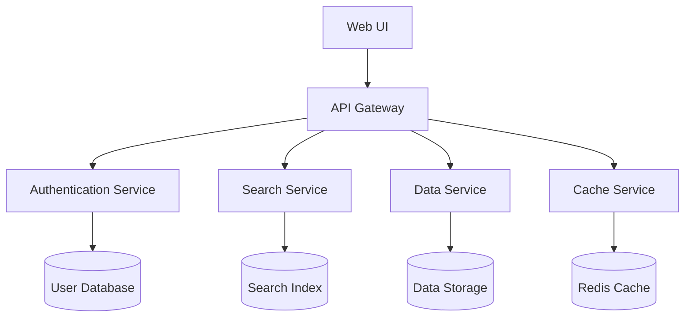

# Architecture Overview

> ⚠️ **Warning:** This file was generated by AI and has not been reviewed yet.

ExplorerIO is built with a modern, scalable architecture designed to handle complex data exploration tasks efficiently. This document provides an overview of the system's architectural principles and design patterns.

## High-Level Architecture

ExplorerIO follows a microservices architecture pattern, separating concerns into distinct, loosely-coupled components that can be developed, deployed, and scaled independently.

## Core Principles

### 1. Separation of Concerns
Each service has a single, well-defined responsibility:
- **Authentication Service**: User management and security
- **Data Service**: Data ingestion and processing
- **Search Service**: Indexing and search functionality
- **Cache Service**: Performance optimization through caching

### 2. Scalability
The architecture supports horizontal scaling:
- Stateless services that can be replicated
- Load balancing across service instances
- Database sharding for large datasets

### 3. Resilience
Built-in fault tolerance mechanisms:
- Circuit breakers for service-to-service communication
- Graceful degradation when services are unavailable
- Comprehensive error handling and logging

### 4. Performance
Optimized for speed and efficiency:
- Intelligent caching strategies
- Asynchronous processing for heavy operations
- Database query optimization

## Technology Stack

### Frontend
- **Framework**: Modern JavaScript framework (React/Vue.js)
- **State Management**: Redux/Vuex for application state
- **UI Components**: Material Design components
- **Build Tools**: Webpack/Vite for bundling and optimization

### Backend
- **Runtime**: Node.js/Python for service implementation
- **API**: RESTful APIs with OpenAPI documentation
- **Authentication**: JWT tokens with refresh mechanism
- **Message Queue**: Redis/RabbitMQ for asynchronous processing

### Data Layer
- **Primary Database**: PostgreSQL for structured data
- **Search Engine**: Elasticsearch for full-text search
- **Cache**: Redis for session and data caching
- **File Storage**: S3-compatible object storage

### Infrastructure
- **Containerization**: Docker containers for all services
- **Orchestration**: Docker Compose for local development
- **Monitoring**: Prometheus and Grafana for metrics
- **Logging**: Centralized logging with ELK stack

## Security Architecture

Security is built into every layer of the architecture:

### Authentication & Authorization
- JWT-based authentication
- Role-based access control (RBAC)
- API key management for service-to-service communication

### Data Protection
- Encryption at rest and in transit
- Input validation and sanitization
- SQL injection prevention
- CORS configuration

### Network Security
- Service mesh for secure inter-service communication
- Network segmentation
- Rate limiting and DDoS protection

## Deployment Architecture

ExplorerIO supports multiple deployment scenarios:

### Development
- Docker Compose for local development
- Hot reloading for rapid development
- Mock services for testing

### Staging
- Kubernetes deployment
- Automated testing pipeline
- Environment parity with production

### Production
- Multi-zone deployment for high availability
- Auto-scaling based on load
- Blue-green deployment strategy
- Comprehensive monitoring and alerting

## Next Steps

- Explore the [Modules & Components](modules-and-components.md) for detailed component information
- Learn about the [Workflow](workflow.md) to understand data flow through the system
- Check the [Installation Guide](../installation/docker-compose.md) to set up your own instance
