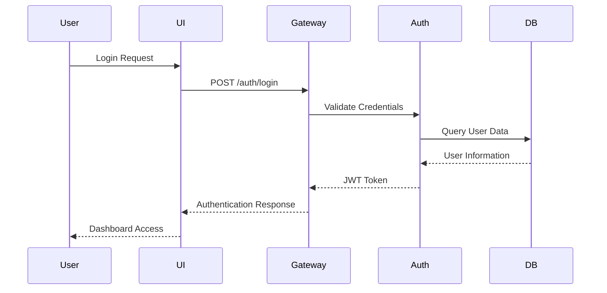
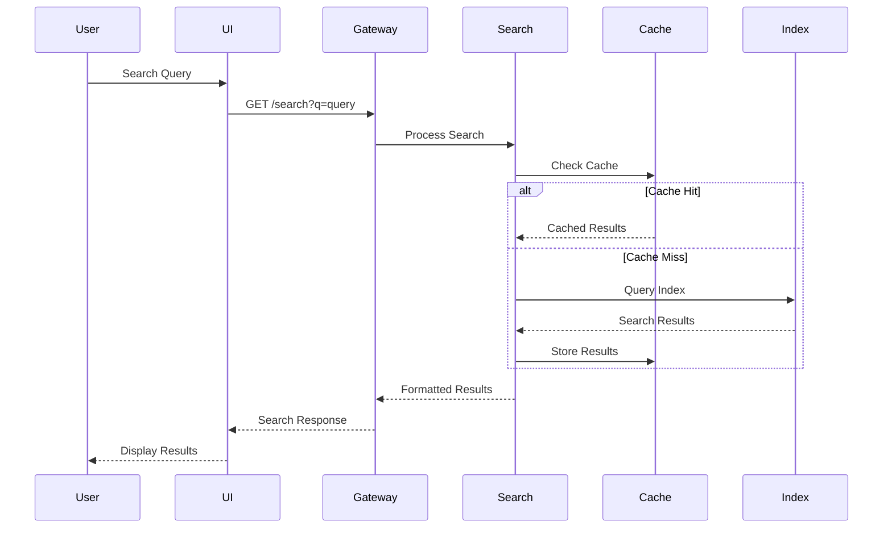
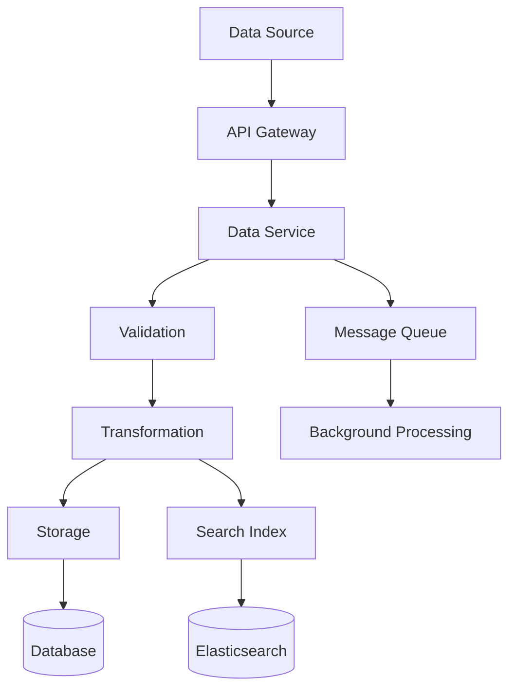
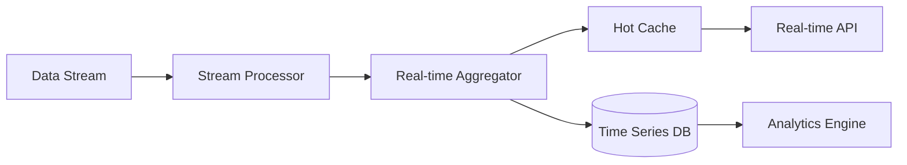
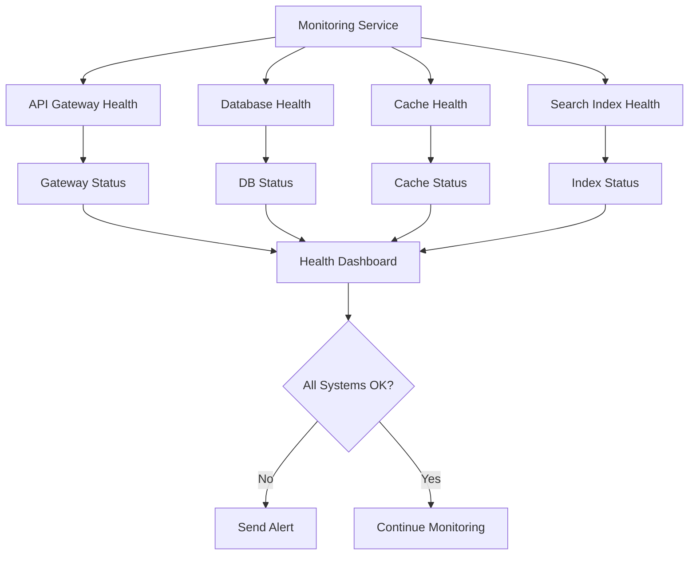
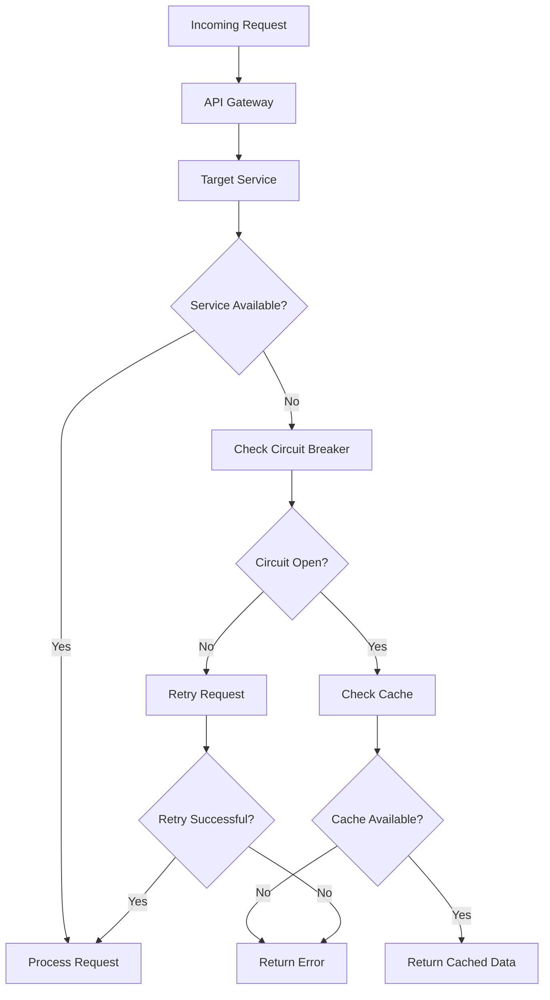
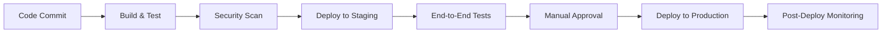
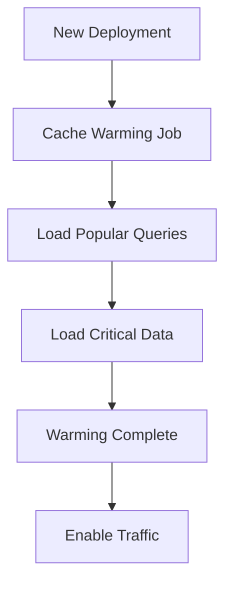

# Workflow

> ⚠️ **Warning:** This file was generated by AI and has not been reviewed yet.

This document describes the data flow and operational workflows within ExplorerIO, helping you understand how different components interact to process and serve data.

## User Interaction Workflow

### 1. User Authentication Flow

**Steps**:
1. User submits login credentials through the web interface
2. UI sends authentication request to API Gateway
3. Gateway routes request to Authentication Service
4. Auth Service validates credentials against user database
5. Upon successful validation, JWT token is generated
6. Token is returned to user for subsequent requests

### 2. Data Search Workflow

**Steps**:
1. User enters search query in the interface
2. Search request is sent to the API Gateway
3. Search Service first checks the cache for existing results
4. If cache miss, query is executed against the search index
5. Results are cached for future requests
6. Formatted results are returned to the user

## Data Processing Workflow

### 1. Data Ingestion Flow

**Process**:
1. **Data Reception**: External data sources send data via REST API
2. **Validation**: Incoming data is validated against defined schemas
3. **Transformation**: Data is normalized and enriched as needed
4. **Parallel Storage**: Data is simultaneously stored in:
   - Primary database for transactional operations
   - Search index for full-text search capabilities
5. **Asynchronous Processing**: Heavy operations are queued for background processing

### 2. Real-time Data Processing

**Components**:
- **Stream Processor**: Handles incoming real-time data streams
- **Real-time Aggregator**: Computes metrics and summaries on-the-fly
- **Hot Cache**: Stores frequently accessed real-time data
- **Time Series DB**: Persistent storage for historical analysis

## System Monitoring Workflow

### 1. Health Check Flow

### 2. Performance Monitoring

**Metrics Collection**:
- Response time tracking for all API endpoints
- Database query performance monitoring
- Cache hit ratio analysis
- Resource utilization (CPU, memory, disk)

**Alerting Thresholds**:
- API response time > 5 seconds
- Database connection pool > 80% utilization
- Cache hit ratio < 70%
- Error rate > 1% over 5-minute window

## Error Handling Workflow

### 1. Service Failure Response

### 2. Data Validation Workflow

**Input Validation Steps**:
1. **Schema Validation**: Verify data structure against predefined schemas
2. **Type Checking**: Ensure data types match expected formats
3. **Business Rule Validation**: Apply domain-specific validation rules
4. **Security Scanning**: Check for potential security threats
5. **Data Enrichment**: Add metadata and computed fields

**Error Handling**:
- Validation errors are logged with detailed context
- Invalid data is quarantined for manual review
- Partial failures allow processing of valid records
- Retry mechanisms for transient failures

## Deployment Workflow

### 1. CI/CD Pipeline

### 2. Rolling Update Process

**Zero-Downtime Deployment**:
1. New version deployed to subset of instances
2. Health checks verify new version stability
3. Traffic gradually shifted to new instances
4. Old instances gracefully shut down
5. Rollback capability maintained throughout process

## Cache Management Workflow

### 1. Cache Warming Strategy

### 2. Cache Invalidation

**Invalidation Triggers**:
- Data updates in primary storage
- Schema changes
- Manual cache clear requests
- TTL expiration

**Invalidation Strategy**:
- Lazy invalidation for non-critical data
- Immediate invalidation for critical updates
- Batch invalidation for bulk operations
- Cascade invalidation for related data

## Next Steps

- Explore the [Installation Guide](../installation/docker-compose.md) to set up your environment
- Learn about [Features](../features/authentication.md) available in ExplorerIO
- Check the [API Documentation](../api/overview.md) for integration details
