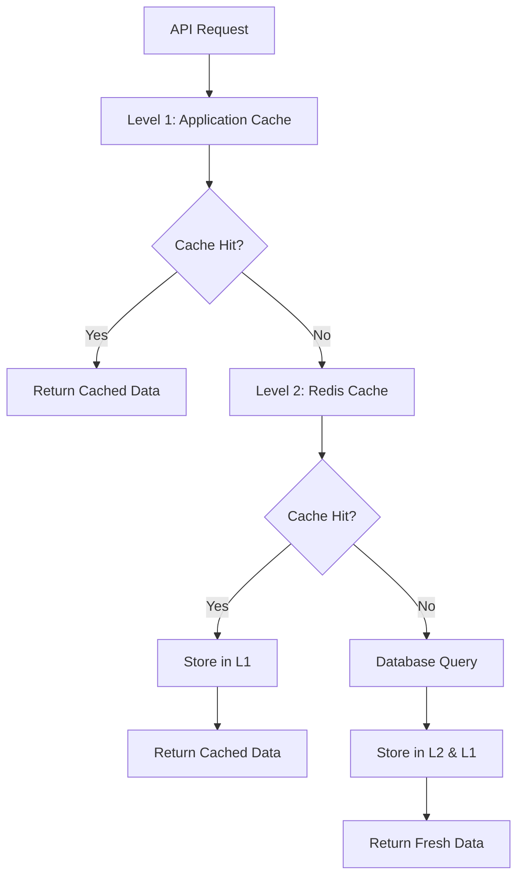

# Cached Data

> ⚠️ **Warning:** This file was generated by AI and has not been reviewed yet.

ExplorerIO implements a sophisticated caching system to optimize performance and reduce load on data sources. This document covers caching strategies, configuration, and management.

## Caching Overview

The caching system in ExplorerIO provides:

- Multi-level caching architecture
- Intelligent cache warming and invalidation
- Performance optimization for frequently accessed data
- Reduced latency for search and API operations
- Configurable TTL (Time To Live) policies
- Cache analytics and monitoring

## Cache Architecture

### Multi-Level Caching

**Level 1 - Application Cache**:
- In-memory caching within application instances
- Fastest access times
- Limited memory capacity
- Process-specific cache

**Level 2 - Redis Cache**:
- Shared cache across all application instances
- Persistent across application restarts
- Distributed caching capabilities
- Configurable memory limits

**Level 3 - Database Query Cache**:
- Database-level query result caching
- Automatic invalidation on data changes
- Optimizes database performance



## Cache Configuration

### Redis Configuration

**Basic Redis Setup**:
```bash
# Redis connection settings
REDIS_HOST=localhost
REDIS_PORT=6379
REDIS_PASSWORD=your_redis_password
REDIS_DB=0
REDIS_PREFIX=explorerio:cache:

# Memory management
REDIS_MAX_MEMORY=512mb
REDIS_MAX_MEMORY_POLICY=allkeys-lru
REDIS_TIMEOUT=5000
```

**Redis Cluster Configuration**:
```bash
# For high-availability Redis setup
REDIS_CLUSTER_ENABLED=true
REDIS_CLUSTER_NODES=redis1:6379,redis2:6379,redis3:6379
REDIS_CLUSTER_PASSWORD=cluster_password
```

### Application Cache Settings

**Cache Configuration**:
```yaml
cache:
  enabled: true
  default_ttl: 300  # 5 minutes
  max_size: 1000    # Maximum number of cached items
  
  # Specific cache configurations
  search_results:
    ttl: 600        # 10 minutes
    max_size: 500
  
  user_sessions:
    ttl: 3600       # 1 hour
    max_size: 10000
  
  api_responses:
    ttl: 180        # 3 minutes
    max_size: 2000
  
  database_queries:
    ttl: 900        # 15 minutes
    max_size: 1500
```

## Caching Strategies

### Cache-Aside Pattern

**Implementation Example**:
```javascript
async function getData(key) {
  // Try to get from cache first
  let data = await cache.get(key);
  
  if (data) {
    return JSON.parse(data);
  }
  
  // Cache miss - fetch from database
  data = await database.query(key);
  
  // Store in cache for future requests
  await cache.set(key, JSON.stringify(data), TTL);
  
  return data;
}
```

### Write-Through Cache

**Implementation Example**:
```javascript
async function updateData(key, data) {
  // Update database first
  await database.update(key, data);
  
  // Update cache immediately
  await cache.set(key, JSON.stringify(data), TTL);
  
  return data;
}
```

### Cache Warming

**Proactive Cache Population**:
```javascript
// Cache warming job
class CacheWarmer {
  async warmPopularData() {
    const popularQueries = await this.getPopularSearchQueries();
    
    for (const query of popularQueries) {
      try {
        const results = await this.executeSearch(query);
        await this.cacheSearchResults(query, results);
      } catch (error) {
        console.error(`Failed to warm cache for query: ${query}`, error);
      }
    }
  }
  
  async getPopularSearchQueries() {
    // Get most frequent search queries from analytics
    return await analytics.getTopQueries(100);
  }
}

// Schedule cache warming
setInterval(async () => {
  const warmer = new CacheWarmer();
  await warmer.warmPopularData();
}, 3600000); // Every hour
```

## Cache Keys and Namespacing

### Key Naming Convention

**Structured Cache Keys**:
```
explorerio:{service}:{operation}:{parameters_hash}
```

**Examples**:
```
explorerio:search:query:a1b2c3d4e5f6
explorerio:user:profile:12345
explorerio:api:endpoint:/data/reports:params_hash
explorerio:db:query:users:filter_hash
```

### Key Generation

**Consistent Key Generation**:
```javascript
const crypto = require('crypto');

function generateCacheKey(service, operation, parameters) {
  const paramString = JSON.stringify(parameters, Object.keys(parameters).sort());
  const hash = crypto.createHash('md5').update(paramString).digest('hex');
  return `explorerio:${service}:${operation}:${hash}`;
}

// Usage examples
const searchKey = generateCacheKey('search', 'query', {
  q: 'analytics',
  filters: { category: 'reports' },
  sort: 'date:desc'
});

const userKey = generateCacheKey('user', 'profile', { userId: 12345 });
```

## Cache Invalidation

### Time-Based Invalidation (TTL)

**TTL Configuration by Data Type**:
```javascript
const TTL_CONFIG = {
  // Frequently changing data
  realtime_metrics: 30,        // 30 seconds
  live_dashboards: 60,         // 1 minute
  
  // Moderately changing data
  search_results: 300,         // 5 minutes
  user_preferences: 1800,      // 30 minutes
  
  // Slowly changing data
  reference_data: 3600,        // 1 hour
  system_config: 7200,         // 2 hours
  
  // Rarely changing data
  user_profiles: 86400,        // 24 hours
  static_content: 604800       // 7 days
};
```

### Event-Based Invalidation

**Automatic Cache Invalidation**:
```javascript
// Database change listener
class CacheInvalidator {
  constructor(cache, eventBus) {
    this.cache = cache;
    this.setupEventListeners(eventBus);
  }
  
  setupEventListeners(eventBus) {
    // Invalidate user-related caches when user data changes
    eventBus.on('user.updated', (userId) => {
      this.invalidateUserCache(userId);
    });
    
    // Invalidate search caches when content is updated
    eventBus.on('content.updated', (contentId) => {
      this.invalidateSearchCache();
    });
    
    // Invalidate report caches when reports are modified
    eventBus.on('report.updated', (reportId) => {
      this.invalidateReportCache(reportId);
    });
  }
  
  async invalidateUserCache(userId) {
    const patterns = [
      `explorerio:user:profile:${userId}`,
      `explorerio:user:preferences:${userId}`,
      `explorerio:user:permissions:${userId}`
    ];
    
    await this.cache.del(patterns);
  }
  
  async invalidateSearchCache() {
    // Invalidate all search-related caches
    await this.cache.delPattern('explorerio:search:*');
  }
}
```

### Manual Cache Management

**Administrative Cache Control**:
```javascript
// Cache management API
app.post('/api/admin/cache/invalidate', async (req, res) => {
  const { pattern, keys } = req.body;
  
  if (pattern) {
    await cache.delPattern(pattern);
  } else if (keys) {
    await cache.del(keys);
  }
  
  res.json({ success: true, message: 'Cache invalidated' });
});

// Clear specific cache categories
app.post('/api/admin/cache/clear/:category', async (req, res) => {
  const { category } = req.params;
  const pattern = `explorerio:${category}:*`;
  
  await cache.delPattern(pattern);
  res.json({ success: true, category, pattern });
});
```

## Performance Optimization

### Cache Hit Ratio Monitoring

**Metrics Collection**:
```javascript
class CacheMetrics {
  constructor() {
    this.stats = {
      hits: 0,
      misses: 0,
      errors: 0,
      totalRequests: 0
    };
  }
  
  recordHit() {
    this.stats.hits++;
    this.stats.totalRequests++;
  }
  
  recordMiss() {
    this.stats.misses++;
    this.stats.totalRequests++;
  }
  
  recordError() {
    this.stats.errors++;
    this.stats.totalRequests++;
  }
  
  getHitRatio() {
    return this.stats.totalRequests > 0 
      ? this.stats.hits / this.stats.totalRequests 
      : 0;
  }
  
  getStats() {
    return {
      ...this.stats,
      hitRatio: this.getHitRatio(),
      missRatio: this.stats.misses / this.stats.totalRequests
    };
  }
}
```

### Cache Size Optimization

**Memory Usage Monitoring**:
```javascript
async function getCacheMemoryUsage() {
  const info = await redis.info('memory');
  const stats = {};
  
  info.split('\r\n').forEach(line => {
    const [key, value] = line.split(':');
    if (key && value) {
      stats[key] = value;
    }
  });
  
  return {
    used_memory: parseInt(stats.used_memory),
    used_memory_human: stats.used_memory_human,
    used_memory_peak: parseInt(stats.used_memory_peak),
    used_memory_peak_human: stats.used_memory_peak_human
  };
}
```

### Cache Compression

**Data Compression for Large Objects**:
```javascript
const zlib = require('zlib');

class CompressedCache {
  async set(key, value, ttl) {
    const serialized = JSON.stringify(value);
    
    // Compress large objects
    if (serialized.length > 1024) {
      const compressed = zlib.gzipSync(serialized);
      await redis.set(`${key}:compressed`, compressed, 'EX', ttl);
    } else {
      await redis.set(key, serialized, 'EX', ttl);
    }
  }
  
  async get(key) {
    // Try compressed version first
    const compressed = await redis.get(`${key}:compressed`);
    if (compressed) {
      const decompressed = zlib.gunzipSync(compressed);
      return JSON.parse(decompressed.toString());
    }
    
    // Fallback to uncompressed
    const uncompressed = await redis.get(key);
    return uncompressed ? JSON.parse(uncompressed) : null;
  }
}
```

## Cache Analytics

### Performance Metrics

**Key Performance Indicators**:
```sql
-- Cache hit ratio by service
SELECT 
  service,
  SUM(hits) as total_hits,
  SUM(misses) as total_misses,
  SUM(hits) / (SUM(hits) + SUM(misses)) * 100 as hit_ratio
FROM cache_metrics 
WHERE timestamp >= NOW() - INTERVAL '24 hours'
GROUP BY service;

-- Most frequently cached items
SELECT 
  cache_key,
  COUNT(*) as access_count,
  AVG(response_time_ms) as avg_response_time
FROM cache_access_log 
WHERE timestamp >= NOW() - INTERVAL '7 days'
GROUP BY cache_key
ORDER BY access_count DESC
LIMIT 20;

-- Cache memory usage over time
SELECT 
  DATE_TRUNC('hour', timestamp) as hour,
  AVG(memory_used_mb) as avg_memory_used,
  MAX(memory_used_mb) as peak_memory_used
FROM cache_memory_stats 
WHERE timestamp >= NOW() - INTERVAL '24 hours'
GROUP BY hour
ORDER BY hour;
```

### Cache Dashboard

**Real-time Cache Monitoring**:
```javascript
// Cache statistics endpoint
app.get('/api/admin/cache/stats', async (req, res) => {
  const stats = await Promise.all([
    getCacheHitRatio(),
    getCacheMemoryUsage(),
    getTopCachedItems(),
    getCacheErrors()
  ]);
  
  res.json({
    hitRatio: stats[0],
    memoryUsage: stats[1],
    topItems: stats[2],
    errors: stats[3],
    timestamp: new Date().toISOString()
  });
});

// Cache health check
app.get('/api/health/cache', async (req, res) => {
  try {
    await redis.ping();
    const hitRatio = await getCacheHitRatio();
    
    const health = {
      status: 'healthy',
      hitRatio: hitRatio,
      responsive: true
    };
    
    // Warning if hit ratio is low
    if (hitRatio < 0.7) {
      health.status = 'warning';
      health.message = 'Cache hit ratio below optimal threshold';
    }
    
    res.json(health);
  } catch (error) {
    res.status(503).json({
      status: 'unhealthy',
      error: error.message
    });
  }
});
```

## Advanced Caching Features

### Distributed Cache Synchronization

**Cache Synchronization Across Instances**:
```javascript
class DistributedCacheSync {
  constructor(redis, localCache) {
    this.redis = redis;
    this.localCache = localCache;
    this.setupSyncChannel();
  }
  
  setupSyncChannel() {
    // Subscribe to cache invalidation messages
    this.redis.subscribe('cache:invalidate');
    
    this.redis.on('message', (channel, message) => {
      if (channel === 'cache:invalidate') {
        const { key, pattern } = JSON.parse(message);
        this.handleInvalidation(key, pattern);
      }
    });
  }
  
  async invalidateDistributed(key) {
    // Invalidate local cache
    this.localCache.del(key);
    
    // Notify other instances
    await this.redis.publish('cache:invalidate', JSON.stringify({ key }));
  }
  
  handleInvalidation(key, pattern) {
    if (key) {
      this.localCache.del(key);
    } else if (pattern) {
      this.localCache.delPattern(pattern);
    }
  }
}
```

### Smart Cache Preloading

**Predictive Cache Loading**:
```javascript
class SmartCachePreloader {
  constructor(cache, analytics) {
    this.cache = cache;
    this.analytics = analytics;
  }
  
  async preloadBasedOnUsage() {
    // Get user access patterns
    const patterns = await this.analytics.getUserAccessPatterns();
    
    for (const pattern of patterns) {
      if (pattern.probability > 0.8) {
        await this.preloadData(pattern.query);
      }
    }
  }
  
  async preloadData(query) {
    const cacheKey = this.generateCacheKey(query);
    const exists = await this.cache.exists(cacheKey);
    
    if (!exists) {
      const data = await this.fetchData(query);
      await this.cache.set(cacheKey, data, 3600); // 1 hour TTL
    }
  }
}
```

## Troubleshooting

### Common Cache Issues

1. **High Memory Usage**: Monitor and tune TTL values
2. **Low Hit Ratio**: Analyze access patterns and adjust cache strategy
3. **Cache Stampede**: Implement cache locking mechanisms
4. **Stale Data**: Review invalidation strategies

### Debugging Cache Issues

**Cache Debugging Tools**:
```bash
# Redis CLI commands for debugging
redis-cli INFO memory
redis-cli INFO stats
redis-cli MONITOR  # Watch real-time commands
redis-cli --scan --pattern "explorerio:*" | head -10
redis-cli GET "specific_cache_key"
redis-cli TTL "specific_cache_key"
```

**Application-level Debugging**:
```javascript
// Enable cache debugging
const debug = require('debug')('cache');

function debugCache(operation, key, hit = null) {
  debug(`${operation}: ${key} ${hit !== null ? (hit ? 'HIT' : 'MISS') : ''}`);
}

// Usage in cache operations
async function cachedGet(key) {
  const data = await cache.get(key);
  debugCache('GET', key, data !== null);
  return data;
}
```

## Next Steps

- Explore [User Interface](user-interface.md) components that benefit from caching
- Learn about [API](../api/overview.md) endpoints for cache management
- Check [Installation](../installation/docker-compose.md) for Redis setup instructions
