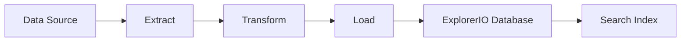

# Services Integration

> ⚠️ **Warning:** This file was generated by AI and has not been reviewed yet.

ExplorerIO is designed to integrate seamlessly with various external services and data sources. This document covers the available integrations and how to configure them for your specific needs.

## Overview

The services integration system in ExplorerIO provides:

- Standardized connectors for popular data sources
- Real-time and batch data synchronization
- Configurable data transformation pipelines
- Monitoring and error handling for all integrations
- Secure credential management

## Database Integrations

### Relational Databases

**Supported Databases**:
- PostgreSQL
- MySQL/MariaDB
- Microsoft SQL Server
- Oracle Database
- SQLite

**Configuration Example (PostgreSQL)**:
```json
{
  "name": "main_database",
  "type": "postgresql",
  "connection": {
    "host": "db.company.com",
    "port": 5432,
    "database": "analytics",
    "username": "readonly_user",
    "password": "${DB_PASSWORD}",
    "ssl": true
  },
  "sync_settings": {
    "mode": "incremental",
    "schedule": "0 */6 * * *",
    "batch_size": 1000
  }
}
```

### NoSQL Databases

**Supported NoSQL Systems**:
- MongoDB
- CouchDB
- Amazon DynamoDB
- Apache Cassandra

**Configuration Example (MongoDB)**:
```json
{
  "name": "user_profiles",
  "type": "mongodb",
  "connection": {
    "uri": "mongodb://cluster.mongodb.net/userdb",
    "auth_database": "admin",
    "username": "analytics_user",
    "password": "${MONGO_PASSWORD}"
  },
  "collections": ["users", "profiles", "preferences"],
  "sync_settings": {
    "mode": "real_time",
    "change_streams": true
  }
}
```

## Cloud Services Integration

### Amazon Web Services (AWS)

**S3 Integration**:
```json
{
  "name": "aws_s3_data",
  "type": "aws_s3",
  "connection": {
    "region": "us-east-1",
    "bucket": "company-data-lake",
    "access_key_id": "${AWS_ACCESS_KEY}",
    "secret_access_key": "${AWS_SECRET_KEY}"
  },
  "file_patterns": ["*.csv", "*.json", "*.parquet"],
  "sync_settings": {
    "mode": "batch",
    "schedule": "0 2 * * *"
  }
}
```

**RDS Integration**:
```json
{
  "name": "aws_rds_analytics",
  "type": "aws_rds",
  "connection": {
    "endpoint": "analytics.cluster-xyz.us-east-1.rds.amazonaws.com",
    "port": 5432,
    "database": "analytics",
    "username": "explorerio",
    "password": "${RDS_PASSWORD}",
    "ssl": true
  }
}
```

### Google Cloud Platform (GCP)

**BigQuery Integration**:
```json
{
  "name": "gcp_bigquery",
  "type": "google_bigquery",
  "connection": {
    "project_id": "company-analytics",
    "dataset_id": "warehouse",
    "credentials_path": "/path/to/service-account.json"
  },
  "tables": ["sales", "customers", "products"],
  "sync_settings": {
    "mode": "incremental",
    "partition_field": "created_at"
  }
}
```

### Microsoft Azure

**Azure SQL Database**:
```json
{
  "name": "azure_sql",
  "type": "azure_sql",
  "connection": {
    "server": "company.database.windows.net",
    "database": "Analytics",
    "username": "explorerio",
    "password": "${AZURE_SQL_PASSWORD}",
    "encrypt": true
  }
}
```

## API Integrations

### REST API Integration

**Generic REST API Connector**:
```json
{
  "name": "crm_api",
  "type": "rest_api",
  "connection": {
    "base_url": "https://api.company.com/v1",
    "authentication": {
      "type": "bearer_token",
      "token": "${CRM_API_TOKEN}"
    },
    "headers": {
      "Content-Type": "application/json",
      "User-Agent": "ExplorerIO/1.0"
    }
  },
  "endpoints": [
    {
      "name": "customers",
      "path": "/customers",
      "method": "GET",
      "pagination": {
        "type": "offset",
        "limit_param": "limit",
        "offset_param": "offset",
        "page_size": 100
      }
    }
  ]
}
```

### GraphQL Integration

```json
{
  "name": "graphql_api",
  "type": "graphql",
  "connection": {
    "url": "https://api.company.com/graphql",
    "authentication": {
      "type": "api_key",
      "header": "X-API-Key",
      "value": "${GRAPHQL_API_KEY}"
    }
  },
  "queries": [
    {
      "name": "user_analytics",
      "query": "query GetUsers($limit: Int) { users(limit: $limit) { id name email created_at } }",
      "variables": { "limit": 1000 }
    }
  ]
}
```

## Message Queue Integrations

### Apache Kafka

```json
{
  "name": "kafka_events",
  "type": "kafka",
  "connection": {
    "bootstrap_servers": ["kafka1:9092", "kafka2:9092"],
    "security_protocol": "SASL_SSL",
    "sasl_mechanism": "PLAIN",
    "sasl_username": "${KAFKA_USERNAME}",
    "sasl_password": "${KAFKA_PASSWORD}"
  },
  "topics": ["user_events", "transaction_events"],
  "consumer_group": "explorerio_analytics",
  "sync_settings": {
    "mode": "real_time",
    "auto_offset_reset": "latest"
  }
}
```

### RabbitMQ

```json
{
  "name": "rabbitmq_queue",
  "type": "rabbitmq",
  "connection": {
    "host": "rabbitmq.company.com",
    "port": 5672,
    "username": "${RABBITMQ_USER}",
    "password": "${RABBITMQ_PASSWORD}",
    "virtual_host": "/analytics"
  },
  "queues": ["data_ingestion", "event_processing"],
  "exchange": "analytics_exchange"
}
```

## Data Transformation

### Transformation Pipeline

**Field Mapping**:
```json
{
  "transformations": [
    {
      "type": "field_mapping",
      "mappings": {
        "customer_id": "id",
        "customer_name": "name",
        "email_address": "email",
        "signup_date": "created_at"
      }
    },
    {
      "type": "data_type_conversion",
      "conversions": {
        "created_at": "datetime",
        "age": "integer",
        "is_active": "boolean"
      }
    },
    {
      "type": "data_enrichment",
      "enrichments": [
        {
          "field": "country",
          "source": "ip_geolocation",
          "input_field": "ip_address"
        }
      ]
    }
  ]
}
```

### Data Validation Rules

```json
{
  "validation_rules": [
    {
      "field": "email",
      "type": "email_format",
      "required": true
    },
    {
      "field": "age",
      "type": "range",
      "min": 0,
      "max": 150
    },
    {
      "field": "country_code",
      "type": "enum",
      "values": ["US", "CA", "UK", "DE", "FR"]
    }
  ],
  "error_handling": {
    "strategy": "quarantine",
    "notification": true
  }
}
```

## Monitoring and Alerting

### Integration Health Monitoring

**Health Check Configuration**:
```json
{
  "health_checks": {
    "enabled": true,
    "interval": 300,
    "timeout": 30,
    "retry_attempts": 3
  },
  "metrics": {
    "connection_status": true,
    "sync_performance": true,
    "error_rates": true,
    "data_freshness": true
  }
}
```

**Alerting Rules**:
```json
{
  "alerts": [
    {
      "name": "Integration Failure",
      "condition": "connection_status == 'failed'",
      "severity": "critical",
      "notification_channels": ["email", "slack"]
    },
    {
      "name": "High Error Rate",
      "condition": "error_rate > 0.05",
      "duration": "5m",
      "severity": "warning"
    },
    {
      "name": "Data Staleness",
      "condition": "last_sync_age > '2h'",
      "severity": "warning"
    }
  ]
}
```

## Security and Credentials Management

### Credential Storage

**Environment Variables**:
```bash
# Database credentials
DB_PASSWORD=secure_database_password
MONGO_PASSWORD=secure_mongo_password

# API keys
CRM_API_TOKEN=abc123xyz789
GRAPHQL_API_KEY=def456uvw012

# Cloud service credentials
AWS_ACCESS_KEY=AKIA...
AWS_SECRET_KEY=wJalr...
```

**Encrypted Credential Store**:
```json
{
  "credential_store": {
    "type": "encrypted_file",
    "encryption_key": "${ENCRYPTION_KEY}",
    "file_path": "/secure/credentials.enc"
  },
  "rotation_policy": {
    "enabled": true,
    "interval": "90d",
    "notification": true
  }
}
```

### Network Security

**VPN/Private Network Configuration**:
```json
{
  "network_security": {
    "use_vpn": true,
    "vpn_endpoint": "vpn.company.com",
    "allowed_ip_ranges": ["10.0.0.0/8", "192.168.1.0/24"],
    "require_ssl": true,
    "ssl_verification": true
  }
}
```

## Data Sync Strategies

### Incremental Sync

**Timestamp-based Incremental Sync**:
```json
{
  "sync_strategy": {
    "type": "incremental",
    "method": "timestamp",
    "timestamp_field": "updated_at",
    "initial_sync": "full",
    "checkpoint_storage": "database"
  }
}
```

**Change Data Capture (CDC)**:
```json
{
  "sync_strategy": {
    "type": "cdc",
    "method": "database_logs",
    "capture_deletes": true,
    "capture_schema_changes": false,
    "batch_size": 1000
  }
}
```

### Real-time Sync

**Webhook Integration**:
```json
{
  "webhook_config": {
    "endpoint": "https://explorerio.company.com/webhooks/data-update",
    "authentication": {
      "type": "hmac_sha256",
      "secret": "${WEBHOOK_SECRET}"
    },
    "retry_policy": {
      "max_attempts": 3,
      "backoff": "exponential"
    }
  }
}
```

## Integration Management API

### Create Integration

```bash
POST /api/integrations
{
  "name": "sales_database",
  "type": "postgresql",
  "connection": { ... },
  "sync_settings": { ... },
  "enabled": true
}
```

### Test Connection

```bash
POST /api/integrations/{id}/test
```

### Trigger Sync

```bash
POST /api/integrations/{id}/sync
{
  "type": "full",
  "async": true
}
```

### Get Sync Status

```bash
GET /api/integrations/{id}/status
```

## Common Integration Patterns

### ETL Pipeline



### Real-time Streaming


## Troubleshooting

### Connection Issues

1. **Network Connectivity**: Test network access to external services
2. **Authentication**: Verify credentials and permissions
3. **SSL/TLS**: Check certificate validity and SSL configuration
4. **Firewall**: Ensure required ports are open

### Performance Issues

1. **Batch Size**: Optimize batch sizes for better performance
2. **Parallel Processing**: Enable parallel processing for large datasets
3. **Indexing**: Ensure proper indexing on source systems
4. **Resource Allocation**: Monitor CPU and memory usage

### Debugging

**Enable Debug Logging**:
```bash
INTEGRATION_DEBUG=true
INTEGRATION_LOG_LEVEL=debug
```

**Monitor Integration Metrics**:
```bash
# Check integration health
curl http://localhost:8080/api/integrations/health

# Get sync statistics
curl http://localhost:8080/api/integrations/stats
```

## Next Steps

- Explore [Search Functionality](search-functionality.md) to make your integrated data searchable
- Learn about [Caching Strategies](cached-data.md) to optimize performance
- Check the [API Documentation](../api/overview.md) for detailed integration endpoints
